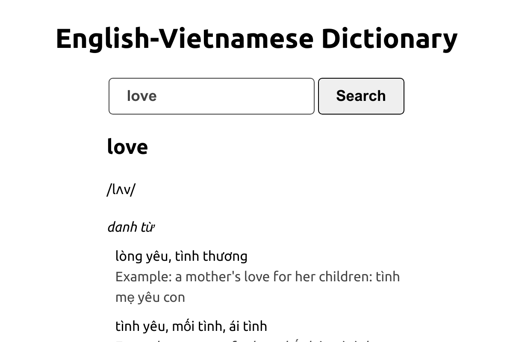

<div align="center">
    <h1>Envidict 📖</h1>
</div>

<p align="center">
    <a href="https://envidict.vietduc01100001.tech">Website</a>
</p>

<h1></h1>



**A lightning-fast ⚡ English-Vietnamese dictionary website**

- **Fast**: the API is written in Go.
- **Related words suggestions**: using tree data structure to provide accurate suggestions.

## How to run locally?

```console
docker build -t envidict .
docker run -it --rm -p 3000:3000 -p 5000:5000 --name envidict envidict
```

Access the app at [http://localhost:3000](http://localhost:3000).
